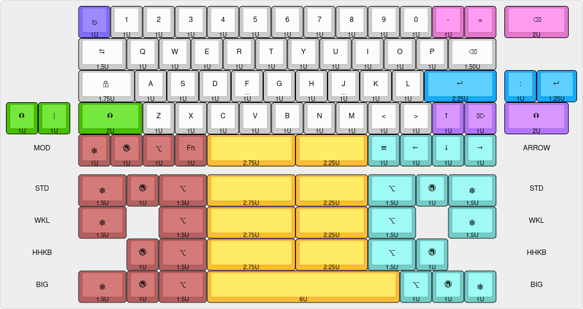

# LK56HS 55% Staggered Hot-Swappable Keyboard

## Layout

[Keyboard Layout Editor](https://www.keyboard-layout-editor.com/##@_css=.keyborder%5Bstyle*%2F=%22%237c6df0%22%5D%20%7B%0A%20%20%20%20border-radius%2F:%2050%25%20!important%2F%3B%0A%20%20%20%20background-color%2F:%20%237c6dff%20!important%2F%3B%0A%7D%0A.keytop%5Bstyle*%2F=%22%239d89ff%22%5D%20%7B%0A%20%20%20%20border-radius%2F:%2050%25%20!important%2F%3B%0A%20%20%20%20background-color%2F:%20%239e8aff%20!important%2F%3B%0A%7D%0A%0A.keyborder%5Bstyle*%2F=%22%23e377c0%22%5D%20%7B%0A%20%20%20%20border-radius%2F:%2050%25%20!important%2F%3B%0A%20%20%20%20background-color%2F:%20%23e377cc%20!important%2F%3B%0A%7D%0A.keytop%5Bstyle*%2F=%22%23ff9ce6%22%5D%20%7B%0A%20%20%20%20border-radius%2F:%2050%25%20!important%2F%3B%0A%20%20%20%20background-color%2F:%20%23ff9cf2%20!important%2F%3B%0A%7D%3B&@_x:2.25&c=%237c6dff&p=R1&a:7%3B&=%3Ci%20class%2F='mss%20mss-Unicode-Escape-3'%3E%3C%2F%2Fi%3E%0A%0A%0A%0A1U&_c=%23cccccc%3B&=1%0A%0A%0A%0A1U&=2%0A%0A%0A%0A1U&=3%0A%0A%0A%0A1U&=4%0A%0A%0A%0A1U&=5%0A%0A%0A%0A1U&=6%0A%0A%0A%0A1U&=7%0A%0A%0A%0A1U&=8%0A%0A%0A%0A1U&=9%0A%0A%0A%0A1U&=0%0A%0A%0A%0A1U&_c=%23e377cc%3B&=-%0A%0A%0A%0A1U&=%2F=&_x:0.25&p=R4&w:2%3B&=%3Ci%20class%2F='kb%20kb-Unicode-BackSpace-DeleteLeft-Big'%3E%3C%2F%2Fi%3E%0A%0A%0A%0A2U%3B&@_x:2.25&c=%23cccccc&p=R2&w:1.5%3B&=%3Ci%20class%2F='kb%20kb-Tab-1'%3E%3C%2F%2Fi%3E%0A%0A%0A%0A1.5U&=Q%0A%0A%0A%0A1U&=W%0A%0A%0A%0A1U&=E%0A%0A%0A%0A1U&=R%0A%0A%0A%0A1U&=T%0A%0A%0A%0A1U&=Y%0A%0A%0A%0A1U&=U%0A%0A%0A%0A1U&=I%0A%0A%0A%0A1U&=O%0A%0A%0A%0A1U&=P%0A%0A%0A%0A1U&_w:1.5%3B&=%3Ci%20class%2F='kb%20kb-Unicode-BackSpace-DeleteLeft-Big'%3E%3C%2F%2Fi%3E%0A%0A%0A%0A1.50U%3B&@_x:2.25&p=R3&w:1.75%3B&=%3Ci%20class%2F='kb%20kb-Unicode-Lock-Closed-1'%3E%3C%2F%2Fi%3E%0A%0A%0A%0A1.75U&=A%0A%0A%0A%0A1U&=S%0A%0A%0A%0A1U&=D%0A%0A%0A%0A1U&_n:true%3B&=F%0A%0A%0A%0A1U&=G%0A%0A%0A%0A1U&=H%0A%0A%0A%0A1U&_n:true%3B&=J%0A%0A%0A%0A1U&=K%0A%0A%0A%0A1U&=L%0A%0A%0A%0A1U&_c=%2317aaff&p=R4&w:2.25%3B&=%3Ci%20class%2F='kb%20kb-Return-2'%3E%3C%2F%2Fi%3E%0A%0A%0A%0A2.25U&_x:0.25%3B&=%2F:%0A%0A%0A%0A1U&_w:1.25%3B&=%3Ci%20class%2F='kb%20kb-Return-2'%3E%3C%2F%2Fi%3E%0A%0A%0A%0A1.25U%3B&@_c=%2348bf00%3B&=%3Ci%20class%2F='kb%20kb-Arrows-Up-Circle-Filled'%3E%3C%2F%2Fi%3E%0A%0A%0A%0A1U&=%7C%0A%0A%0A%0A1U&_x:0.25&w:2%3B&=%3Ci%20class%2F='kb%20kb-Arrows-Up-Circle-Filled'%3E%3C%2F%2Fi%3E%0A%0A%0A%0A2U&_c=%23cccccc%3B&=Z%0A%0A%0A%0A1U&=X%0A%0A%0A%0A1U&=C%0A%0A%0A%0A1U&=V%0A%0A%0A%0A1U&=B%0A%0A%0A%0A1U&=N%0A%0A%0A%0A1U&=M%0A%0A%0A%0A1U&=%3C%0A%0A%0A%0A1U&=%3E%0A%0A%0A%0A1U&_c=%23b275ff%3B&=%3Ci%20class%2F='kb%20kb-Arrows-Up'%3E%3C%2F%2Fi%3E%0A%0A%0A%0A1U&=%3Ci%20class%2F='kb%20kb-Unicode-DeleteRight-Big'%3E%3C%2F%2Fi%3E%0A%0A%0A%0A1U&_x:0.25&w:2%3B&=%3Ci%20class%2F='kb%20kb-Arrows-Up-Circle-Filled'%3E%3C%2F%2Fi%3E%0A%0A%0A%0A2U%3B&@_c=%23cccccc&p=R2&w:2.25&d:true%3B&=MOD&_c=%23b56060&p=R4%3B&=%3Ci%20class%2F='mss%20mss-Unicode-Control-4'%3E%3C%2F%2Fi%3E%0A%0A%0A%0A1U&=%3Ci%20class%2F='kb%20kb-logo-linux-tux-ibm'%3E%3C%2F%2Fi%3E%0A%0A%0A%0A1U&=%3Ci%20class%2F='mss%20mss-Unicode-Option-3'%3E%3C%2F%2Fi%3E%0A%0A%0A%0A1U&=Fn%0A%0A%0A%0A1U&_c=%23ffbc36&p=SPACE&w:2.75%3B&=%0A%0A%0A%0A2.75U&_w:2.25%3B&=%0A%0A%0A%0A2.25U&_c=%2372ccc7%3B&=%3Ci%20class%2F='kb%20kb-Hamburger-Menu'%3E%3C%2F%2Fi%3E%0A%0A%0A%0A1U&_p=R2%3B&=%3Ci%20class%2F='kb%20kb-Arrows-Left'%3E%3C%2F%2Fi%3E%0A%0A%0A%0A1U&=%3Ci%20class%2F='kb%20kb-Arrows-Down'%3E%3C%2F%2Fi%3E%0A%0A%0A%0A1U&=%3Ci%20class%2F='kb%20kb-Arrows-Right'%3E%3C%2F%2Fi%3E%0A%0A%0A%0A1U&_c=%23cccccc&w:2.5&d:true%3B&=ARROW%3B&@_y:0.25&w:2.25&d:true%3B&=STD&_c=%23b56060&p=R4&w:1.5%3B&=%3Ci%20class%2F='mss%20mss-Unicode-Control-4'%3E%3C%2F%2Fi%3E%0A%0A%0A%0A1.5U&=%3Ci%20class%2F='kb%20kb-logo-linux-tux-ibm'%3E%3C%2F%2Fi%3E%0A%0A%0A%0A1U&_w:1.5%3B&=%3Ci%20class%2F='mss%20mss-Unicode-Option-3'%3E%3C%2F%2Fi%3E%0A%0A%0A%0A1.5U&_c=%23ffbc36&p=SPACE&w:2.75%3B&=%0A%0A%0A%0A2.75U&_w:2.25%3B&=%0A%0A%0A%0A2.25U&_c=%2372ccc7&p=R2&w:1.5%3B&=%3Ci%20class%2F='mss%20mss-Unicode-Option-3'%3E%3C%2F%2Fi%3E%0A%0A%0A%0A1.5U&_p=R4%3B&=%3Ci%20class%2F='kb%20kb-logo-linux-tux-ibm'%3E%3C%2F%2Fi%3E%0A%0A%0A%0A1U&_p=R2&w:1.5%3B&=%3Ci%20class%2F='mss%20mss-Unicode-Control-4'%3E%3C%2F%2Fi%3E%0A%0A%0A%0A1.5U&_c=%23cccccc&w:2.5&d:true%3B&=STD%3B&@_w:2.25&d:true%3B&=WKL&_c=%23b56060&p=R4&w:1.5%3B&=%3Ci%20class%2F='mss%20mss-Unicode-Control-4'%3E%3C%2F%2Fi%3E%0A%0A%0A%0A1.5U&_x:1&w:1.5%3B&=%3Ci%20class%2F='mss%20mss-Unicode-Option-3'%3E%3C%2F%2Fi%3E%0A%0A%0A%0A1.5U&_c=%23ffbc36&p=SPACE&w:2.75%3B&=%0A%0A%0A%0A2.75U&_w:2.25%3B&=%0A%0A%0A%0A2.25U&_c=%2372ccc7&p=R2&w:1.5%3B&=%3Ci%20class%2F='mss%20mss-Unicode-Option-3'%3E%3C%2F%2Fi%3E%0A%0A%0A%0A1.5U&_x:1&w:1.5%3B&=%3Ci%20class%2F='mss%20mss-Unicode-Control-4'%3E%3C%2F%2Fi%3E%0A%0A%0A%0A1.5U&_c=%23cccccc&w:2.5&d:true%3B&=WKL%3B&@_w:2.25&d:true%3B&=HHKB&_x:1.5&c=%23b56060&p=R4%3B&=%3Ci%20class%2F='kb%20kb-logo-linux-tux-ibm'%3E%3C%2F%2Fi%3E%0A%0A%0A%0A1U&_w:1.5%3B&=%3Ci%20class%2F='mss%20mss-Unicode-Option-3'%3E%3C%2F%2Fi%3E%0A%0A%0A%0A1.5U&_c=%23ffbc36&p=SPACE&w:2.75%3B&=%0A%0A%0A%0A2.75U&_w:2.25%3B&=%0A%0A%0A%0A2.25U&_c=%2372ccc7&p=R2&w:1.5%3B&=%3Ci%20class%2F='mss%20mss-Unicode-Option-3'%3E%3C%2F%2Fi%3E%0A%0A%0A%0A1.5U&_p=R4%3B&=%3Ci%20class%2F='kb%20kb-logo-linux-tux-ibm'%3E%3C%2F%2Fi%3E%0A%0A%0A%0A1U&_x:1.5&c=%23cccccc&p=R2&w:2.5&d:true%3B&=HHKB%3B&@_w:2.25&d:true%3B&=BIG&_c=%23b56060&p=R4&w:1.5%3B&=%3Ci%20class%2F='mss%20mss-Unicode-Control-4'%3E%3C%2F%2Fi%3E%0A%0A%0A%0A1.5U&=%3Ci%20class%2F='kb%20kb-logo-linux-tux-ibm'%3E%3C%2F%2Fi%3E%0A%0A%0A%0A1U&_w:1.5%3B&=%3Ci%20class%2F='mss%20mss-Unicode-Option-3'%3E%3C%2F%2Fi%3E%0A%0A%0A%0A1.5U&_c=%23ffbc36&p=SPACE&w:6%3B&=%0A%0A%0A%0A6U&_c=%2372ccc7&p=R2%3B&=%3Ci%20class%2F='mss%20mss-Unicode-Option-3'%3E%3C%2F%2Fi%3E%0A%0A%0A%0A1U&=%3Ci%20class%2F='kb%20kb-logo-linux-tux-ibm'%3E%3C%2F%2Fi%3E%0A%0A%0A%0A1U&=%3Ci%20class%2F='mss%20mss-Unicode-Control-4'%3E%3C%2F%2Fi%3E%0A%0A%0A%0A1U&_c=%23cccccc&w:2.5&d:true%3B&=BIG)

## PCB

|          PCB (Front)          |         PCB (Back)          |
| :---------------------------: | :-------------------------: |
| [![PCB Front]][PCB Front PNG] | [![PCB Back]][PCB Back PNG] |

[PCB Front]: output/pcb/img/lk56hs-pcb-top.svg
[PCB Front PNG]: output/pcb/img/lk56hs-pcb-top.png
[PCB Back]: output/pcb/img/lk56hs-pcb-bottom.svg
[PCB Back PNG]: output/pcb/img/lk56hs-pcb-bottom.png

The PCB has been designed in [KiCad EDA 9.0](https://www.kicad.org/) using the [`kicad-lkbd`](https://github.com/lambdakb/kicad-lkbd) libraries and [`kbplacer`](https://github.com/adamws/kicad-kbplacer).

You can preview the project files using [KiCanvas](https://kicanvas.org/?github=https%3A%2F%2Fgithub.com%2Flambdakb%2Fkeyboard-lk56hs%2Fblob%2Fmain%2Fpcb%2Flk56hs-pcb.kicad_pro) directly in your browser and download the latest fabrication files for JLCPCB from the [latest release](https://github.com/lambdakb/keyboard-lk56hs/releases/latest/).

The exported schematic is also available under [`output/schematics`](output/schematics/).

### PCB Order

| Parameters                       | Value                  |
| -------------------------------- | ---------------------- |
| Base Material                    | FR4                    |
| Layers                           | 2                      |
| Dimensions                       | 247.65 × 95.25 mm      |
| PCB Thickness                    | 1.6 mm                 |
| PCB Color                        | Blue                   |
| Silkscreen                       | White                  |
| Surface Finish  | Lead Free HASL or ENIG |
| Copper Weight                    | 1 oz                   |
| Via Covering                     | Tented                 |
| Min Via Hole Size                | 0.3 mm                 |
| Board Outline Tolerance          | ± 0.2 mm               |

[^surface-finish]: The "HASL (with lead)" option is extremely discouraged due to the risk of lead poisoning. We strongly recommend paying the premium for the "Lead Free HASL" option.
